# RTL Text Mesh Pro
This plugin adds Right-to-left language support to "TextMeshPro" Unity plugin. 
You need to have `TextMeshPro` plugin in your project. You can install TMPro via `Package Manager`.

Currently Arabic, Farsi and Hebrew are supported. If you find an issue with one of these languages or want support for another RTL language, open an issue.

- [Features](#features)
- [Installation](#installation)
- [Creating Fonts](#how-to-create-font-assets)
- [Usage](#usage-description)
- [Known Issues](#known-issues)
- [Contribution](#contribution)

# Features
### Farsi, Arabic and Hebrew

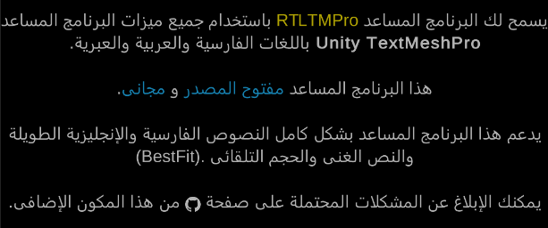
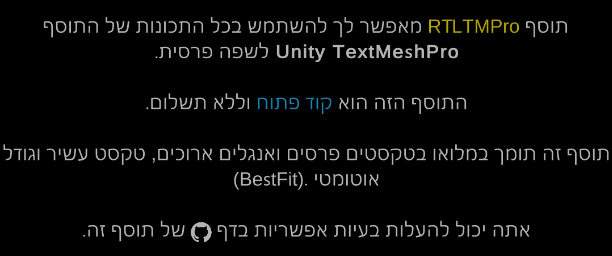

### Realtime RTL Text
You don't need to convert, copy and paste texts. Start writing and texts will be converted right away.  
  
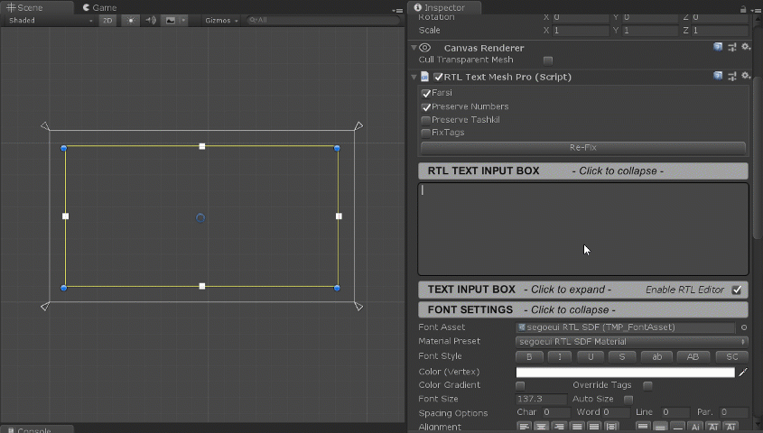

### Rich Text
All `Text Mesh Pro`'s tags are available in `RTL Text Mesh Pro`
  

### RTL InputField (See [known issues](#known-issues))
Realtime InputField is supported.  
  
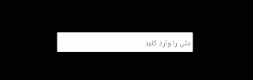  

### RTL Dropdown (See [known issues](#known-issues))
  
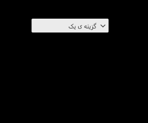

### Multiline
Yes, This plugin has no problem with multiline RTL texts.
  
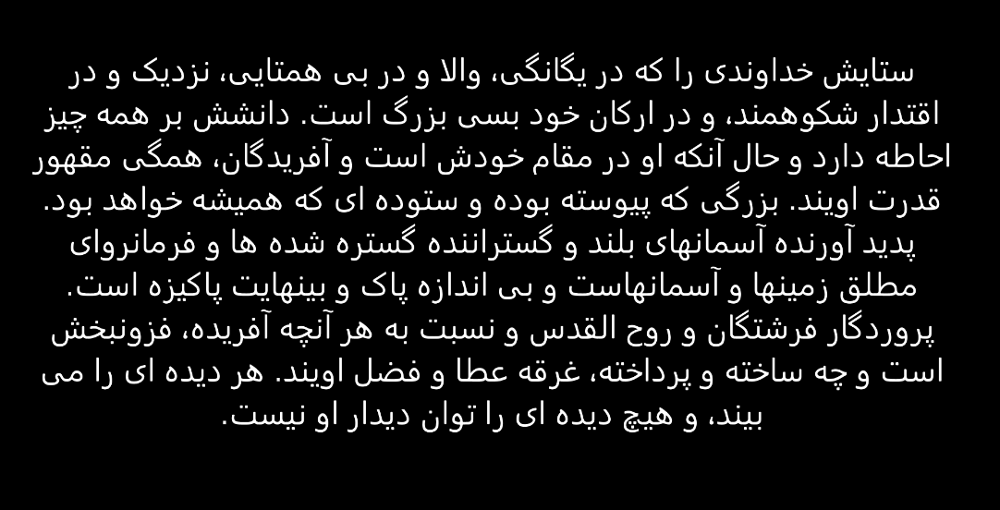

### AutoSize
Auto Font Size is fully supported.  
  
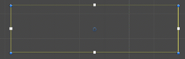

### English, Farsi and Arabic digits are supported
  
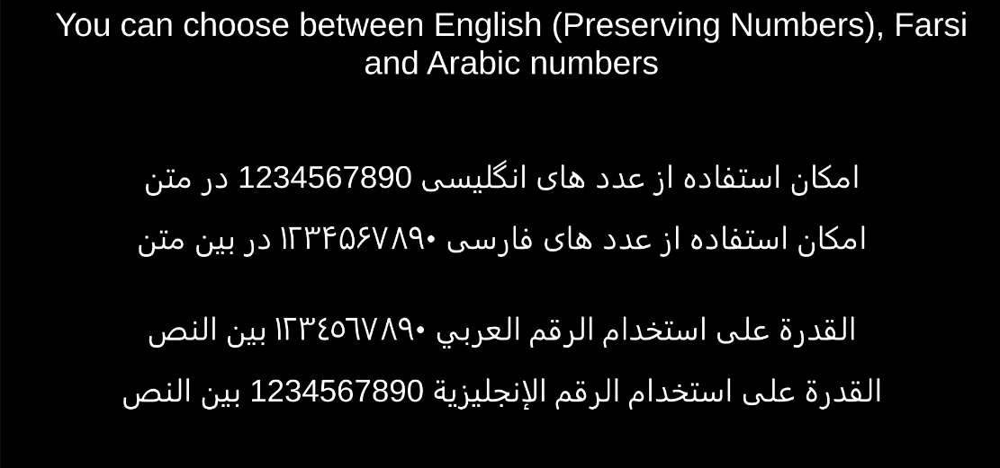

### Arabic Tashkeel
Arabic tashkeel are supported.  
  
  

### Zero-Width No-Joiner character support
You can insert Zero-Width No-Joiner character with Ctrl+Shift+2 hotkey.  
  
  

# Installation
> :information_source: You need to have `TextMeshPro` plugin in your project. You can install TMPro via `Package Manager`. DO NOT Install Text Mesh Pro from Asset Store.
 
### from .unitypackage file
Download the latest unitypackage file from the [releases](https://github.com/sorencoder/RTLTMPro/releases) section and import it into your project from "Assets -> Import Package -> Custom Package..." menu in Unity.

### from OpenUPM
[hk1ll3r](https://github.com/hk1ll3r/) maintains a package manager version of this repo on [OpenUPM](https://openupm.com/packages/com.nosuchstudio.rtltmpro/).

In Project Settings window, add OpenUPM as a scoped registry or if you have already added it, add the new scope to it.

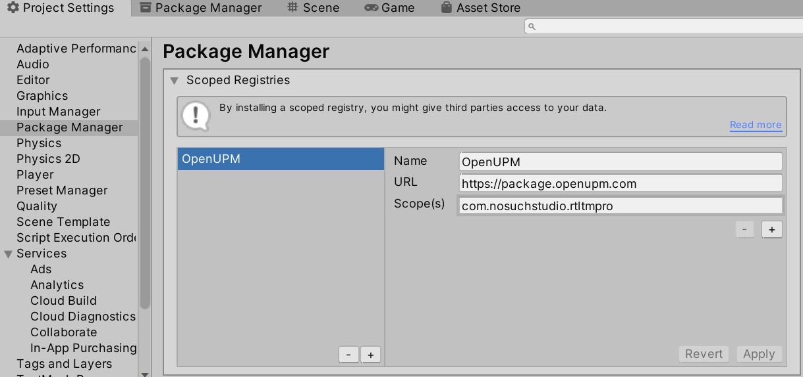

Then in Package Manager window, change scope to *My Registries*. Select "RTL Text Mesh Pro" package and press *Install*.

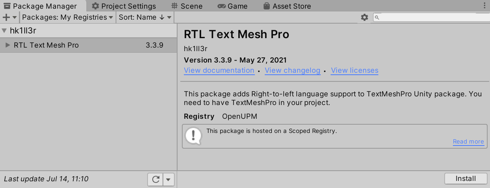

The sample scenes and demo resources (fonts, shaders, etc.) are included in the package as a .unitypackage file. You need to import those into your Assets folder to use them. From the project window navigate to the package folder and double click "RTLTMPRo-demo-resources" file to import these assets into your project.

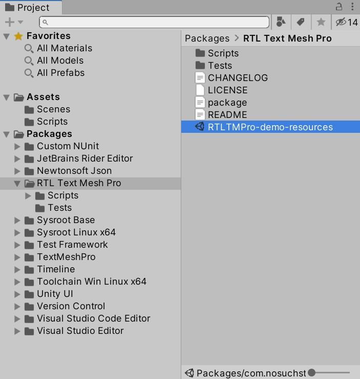

# How To Create Font Assets
You need to create font assets from font files to use them with TextMeshPro. Here are basic instructions for convenience. You can check out the [official TextMeshPro documentation](https://docs.unity3d.com/Packages/com.unity.textmeshpro@4.0/manual/FontAssetsCreator.html) to learn more.
  
Open `Window/TextMeshPro/Font Asset Creator` window.

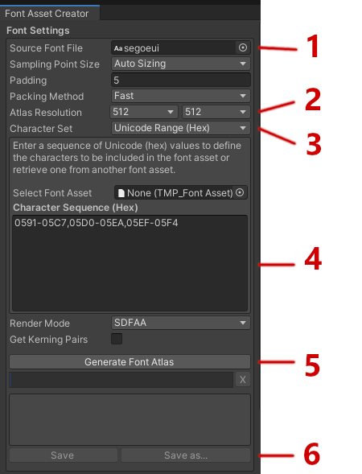

1. Assign your font in `Font Source` field (Your font must include your characters)
2. Set atlas size. For Arabic we recomment 512x512 and for Hebrew 128x128 as a minimum. A larger atlas will have better quality but larger size on disk.
3. Set `Character Set` to `Unicode Range`.
4. Copy character ranges from files under `Assets/RTLTMPro/Ranges` folder into `Character Sequence (Hex)`.
   * Arabic letters are in `ArabicLetters.txt` file
   * Arabic digits are in `ArabicDigits.txt` file
   * Arabic tashkeel letter are in `ArabicTashkeel.txt` file.
   * All arabic characters are in `ArabicAll.txt`. Normally you would use this to create your font asset.
   * Hebrew letters are in `HebrewLetters.txt`.
6. Press `Generate Font Atlas` button and wait for it to generate the atlas.
7. Press `Save TextMeshPro Font Asset` and save the font asset.
  
## Usage Description

* Use `GameObject/UI/* - RTLTMP` menu to create RTL UI elements. (Alternatively you can replace `Text Mesh Pro UGUI` components with `RTL Text Mesh Pro`)
* Assign your font asset `Font Asset` property in `RTL Text Mesh Pro` component 
* Enter text in `RTL TEXT INPUT BOX` secion.

### Farsi
When checked, English numbers will be converted to Farsi numbers.
When unchecked, English numbers will be converted to Arabic numbers.  

### Preserve Numbers
When checked numbers will not be converted.  

### Force Fix
RTL Text Mesh Pro does not fix texts that start with English characters. 
Checking this checkbox forces RTL TextMeshPro to fix the text even when it starts with English character. 
**Multiline English texts will have problem on components that have `ForceFix` checked.**  

### Fix Tags
When checked, RTL Text Mesh Pro will try to fix rich text tags.  

# Known Issues
* **Fixed in latest version. For older versions follow the steps below**.
  We need to override the `text` property of `TextMeshProUGUI`. But the `text` property is not defined `virtual`. You need to manually make the property virtual.  
  * Open `TMP_Text.cs` from TextMeshPro source code
  * add virtual keyword to text property.  
  
  * Open `RTLTextMeshPro.cs` and uncomment the top line where it says `//#define RTL_OVERRIDE`
  * Now you can use InputFields and Dropdowns.
  
# Contribution
All contributions are welcome. Make sure you follow the project's code style. We actively monitor pull requests.

Contact: 
- sorencoder@gmail.com
- hossein.shbz@gmail.com
